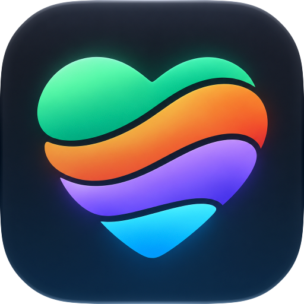

<p align="center">
  
</p>

<h1 align="center">MISHIRUBE</h1>

<p align="center">
  <strong>Training, food, body and sleep in one log.</strong><br>
  Log fast, keep every record on your device, and see what the numbers actually say.
</p>

<p align="center">
  <a href="https://github.com/KoukeNeko/mishirube/actions/workflows/ci.yml"></a>
  
  
  
  <a href="https://github.com/KoukeNeko/mishirube/stargazers"></a>
</p>

<p align="center">
  <a href="#getting-started">Getting started</a>
  · <a href="#privacy-by-design">Privacy</a>
  · <a href="SECURITY.md">Security</a>
  · <a href="#technical-reference">Technical reference</a>
</p>

MISHIRUBE is one place for the things that shape how you feel and perform: workouts, meals,
drinks, weight, body composition, activity and sleep. Turn on only the parts you use; everything
else stays out of the way.

**No account, no server, no tracking.** Records live in a local database on your device. Apple
Health and Health Connect fill in what other apps and your watch already know, and AI is an
optional helper that drafts entries you confirm — never a requirement.

> MISHIRUBE is in active development and tested through internal TestFlight builds. There is no
> public store listing yet.

## Train with your history beside you

### Every set shows the last one

Previous set values appear next to each set as you log, along with an estimated one-rep max and
the personal records worked out from your training history.

### Routines change, history does not

Edit a routine or program template as often as you like. Completed workouts keep exactly what you
did.

### Rest on your wrist

The rest timer runs on the Lock Screen, in the Dynamic Island and on Apple Watch, and the next set
can be logged from the watch.

### Bring your Strong history

Import from Strong is checked before anything changes and is applied as one batch you can undo.

## Log food the way it is labelled

### Eight label systems, each read by its own rules

Taiwan, Japan, the US, the EU, Australia and New Zealand, Korea, China and Canada label food
differently: whether carbohydrate includes fibre, how salt converts to sodium, what a rounded 0
means. MISHIRUBE reads each label by the rules of the country that printed it.

### Point the camera at it

Photo scanning tells a nutrition label from a plate of food. Labels are read row by row; food is
estimated item by item.

### Chain menus already in the library

Drinks and food from 7-Eleven, FamilyMart, Hi-Life, OK Mart, Lawson, Ministop, Seicomart,
Starbucks, MOS Burger, Sukiya and other chains use their published nutrition values, including
caffeine where the chain publishes it.

## Targets that follow your body

Daily energy starts from maintenance. Once the last 21 days hold 14 complete food days and 10
weighings, maintenance is estimated from what you ate and how your weight moved; before that, it
comes from resting energy and activity level. It then moves by the weekly goal you choose: lose
fat, recompose (gain muscle while losing fat), maintain or build muscle. Protein, fat and fibre
follow the goal unless you set them by hand.

Every formula is listed under **Me → References** with its source in the original language and the
rule it supports.

## Trends that say what changed

Trends covers energy balance, protein per kilogram, working sets per muscle against 10 a week,
where the week's sets went, and sleep timing. Each area opens to weekly and weekday views and a
comparison with the previous 12 weeks.

When an analysis lacks the records it needs, it says which records are missing instead of guessing.

## Works with Apple Health and Health Connect

| | Read | Written |
|---|---|---|
| Sleep | Stages, heart rate, breathing, blood oxygen, temperature, HRV | Sleep logged by hand |
| Body | Weight, waist, height, body fat, lean mass, bone mass, body water | The same, as logged |
| Training | Workouts with route, heart rate and pace | Strength workouts and activities |
| Food | Meals and caffeine other apps logged | Meals and their supported nutrients |
| Water | Water records | Water records |
| Mood | State of Mind (iOS 18+) | Mood check-ins (iOS 18+) |
| Activity | Steps, energy, heart and fitness figures | — |

Edit or delete a record in MISHIRUBE and the copy on the platform follows. Imported records are
never written back, and records the app wrote are never imported again, so nothing is counted
twice.

## AI when you want it

- Apple Intelligence's on-device model is used by default when it is on and no other provider is
  chosen.
- Bring your own key for Ollama Cloud, Google AI Studio, Anthropic, Azure AI Foundry or any
  OpenAI-compatible endpoint, or sign in to Microsoft 365 Copilot.
- AI results stay drafts until you confirm them.

## Privacy by design

- There is no account system or backend, and no analytics, advertising or tracking SDKs.
- Records are stored locally in SQLite.
- A cloud AI provider asks for confirmation separately before the first text request and the first
  photo. Photos are sent without location or capture metadata.
- API keys are stored in the Keychain or Keystore and excluded from exports.
- Deleted records are kept as tombstones in the audit history and can be restored.
- Exports include a lossless JSON archive ([schema](doc/archive.schema.json)) and CSV views.

[SECURITY.md](SECURITY.md) lists what the app holds, what leaves the device and when.

## Getting started

1. **Choose what to track** — training, food, weight, activity, sleep, wellness, notes — and hide
   the rest.
2. **Connect Apple Health or Health Connect** from *Me → Data sources*.
3. **Set daily targets** from *Me → Daily targets*.
4. **Choose an AI**, optionally, from *Me → AI*.

## Compatibility

- iPhone and iPad with iOS 15 or newer; the rest timer Live Activity needs iOS 16.2
- Apple Watch with watchOS 10 or newer
- Android 8.0 (API 26) or newer, with Health Connect for health data
- 繁體中文, 简体中文, English, 日本語, 한국어

---

## Technical reference

### Architecture

A Flutter app over a local backend in layers:

| Layer | What it holds |
|---|---|
| `lib/domain/` | The domain model; no storage, file or network logic |
| `lib/backend/storage/` | SQLite through `package:sqlite3`, migrations, one repository per area |
| `lib/backend/engines/` | Deterministic calculation over domain values: training metrics, trends, nutrition |
| `lib/backend/application/` | The use cases screens work through |
| `lib/backend/health/` | Apple Health (`ios/Runner/AppDelegate.swift`) and Health Connect (`HealthConnectBridge.kt`) behind one interface |
| `lib/backend/ai/` | AI provider adapters |
| `lib/features/` | Screens per area, each with its own view model |

SQLite is the source of truth, and writes are transactional. [AGENTS.md](AGENTS.md) lists the rules
the code follows.

### Permissions

- **Health** — read the kinds listed above, and write what is logged in the app.
- **Camera** — scan food, nutrition labels, a body composition scale's screen or a tape measure.
- **Photos** — show the latest photo beside the shutter and pick a photo to scan.
- **Notifications** — the rest timer and bedtime reminders.
- **Internet** — selected cloud AI providers, and map tiles for workout routes (MapKit on iOS,
  MapLibre on Android).

### Development

Use Flutter 3.47.x (Dart ^3.13). The first launch seeds demo content.

```bash
flutter pub get
flutter analyze            # must report "No issues found!"
flutter test               # the whole suite
flutter run
```

Backend tests use in-memory SQLite; geometry tests cover layout contracts; a performance test
requires each read to finish within 2 s with 10,000 sets. TestFlight builds are uploaded by
[`.github/workflows/testflight.yml`](.github/workflows/testflight.yml) when run by hand or on a
`v*` tag.

<p>
  
  
  
  <a href="LICENSE"></a>
</p>

## Third-party content

- Muscle map outlines from [MuscleMap](https://github.com/Jsplice/MuscleMap), MIT
  ([details](third_party/musclemap/README.md)).
- Exercise list and demonstration images from
  [Workout Guide](https://github.com/bryllim/workout-guide): metadata under MIT, images under
  CC BY-SA 4.0 from Everkinetic ([details](third_party/workout-guide/README.md)).

These keep their own licenses, separate from this project's Apache-2.0 license below.

## License

[Apache-2.0](LICENSE) © 2026 KoukeNeko

Apple Health, HealthKit and Apple Watch are trademarks of Apple Inc. Health Connect is a trademark
of Google LLC.
